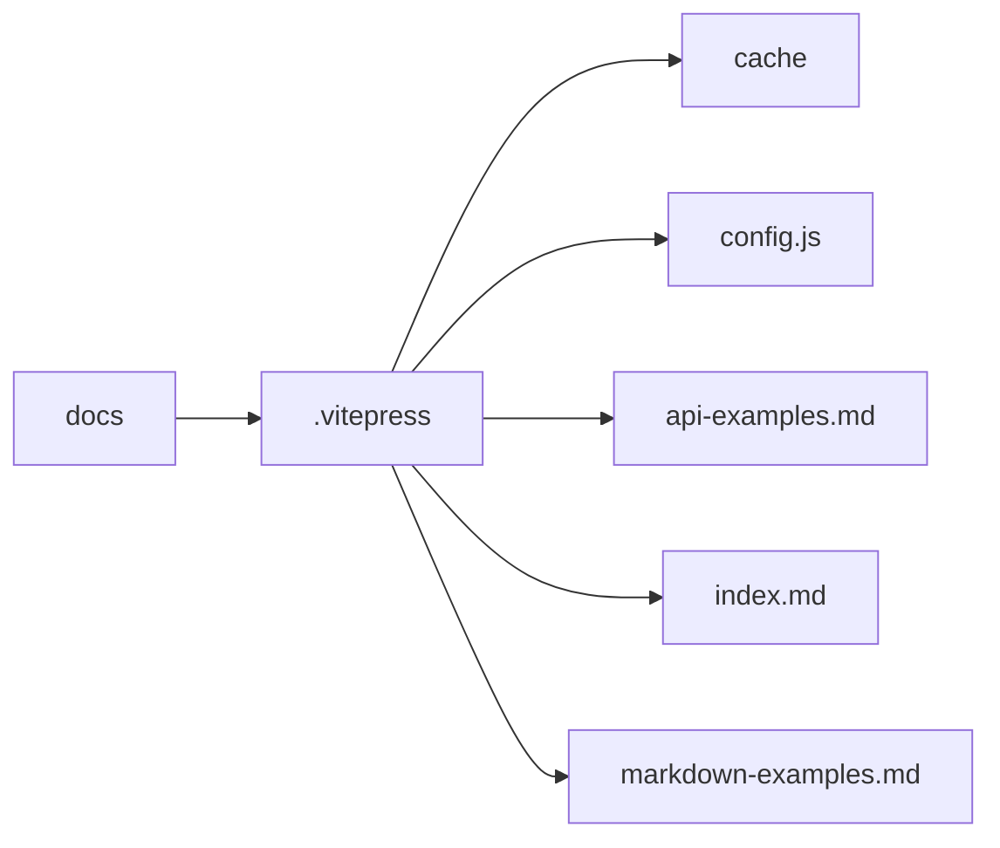

## 快速构建文档网站

VitePress

<navbar>
  <span>符前霖</span>
</navbar>

<!--
今天的话，我来分享一个比较简单的东西。
-->

---
transition: fade-out
---

#  VitePress 是什么？

VitePress 是一个基于 `vite` 的静态站点生成器，专为构建文档网站而设计。
使用 VitePress 可以快速构建出具有优秀用户体验的文档网站。
它是由 Vue.js 的创造者尤雨溪开发。


<!--
You can have `style` tag in markdown to override the style for the current page.
Learn more: https://sli.dev/guide/syntax#embedded-styles
-->

<style>
h1 {
  background-color: #2B90B6;
  background-image: linear-gradient(45deg, #4EC5D4 10%, #146b8c 20%);
  background-size: 100%;
  -webkit-background-clip: text;
  -moz-background-clip: text;
  -webkit-text-fill-color: transparent;
  -moz-text-fill-color: transparent;
}
</style>

<!--
首先讲一下vitepress是什么？它是一个基于vite的静态文档生成器，这个也是大多数，学前端的都接触过，毕竟vue3的文档就是基于它搭建，还有一些ui组件库的文档，也是用它搭建的，比如element-plus。
-->

---
transition: slide-up
---

## VitePress 的主要特点
- 快速启动和热更新：VitePress 采用了 Vite 的核心技术，可以在几乎瞬间启动和热更新，提高开发效率。
- Markdown 文件编写：VitePress 的文档编写采用 Markdown 格式，使得编写文档非常方便，可以快速上手。
- 内置搜索功能：VitePress 内置了搜索功能，可以通过快速检索文档内容来找到需要的信息。
- 自定义主题和插件：VitePress 的主题和插件采用了 Vue.js 的组件化开发方式，可以根据需要对文档网站进行定制化。
- 多语言支持：VitePress 支持多语言，可以为不同语言版本提供不同的主题和配置。


<style>
h2 {
  background-color: #2B90B6;
  background-image: linear-gradient(45deg, #4EC5D4 10%, #146b8c 20%);
  background-size: 100%;
  -webkit-background-clip: text;
  -moz-background-clip: text;
  -webkit-text-fill-color: transparent;
  -moz-text-fill-color: transparent;
}
</style>

<!--
然后它的主要特点有1.2.3.4.5
-->

---
transition: slide-up
---

#  如何开始使用 VitePress？

1. 安装 Node.js 和 pnpm
2. 创建文件夹并进入到项目的目录中
3. 在终端中执行以下命令来安装 VitePress：`pnpm add -D vitepress`。
4. 使用pnpm初始化项目：`pnpm exec vitepress init`。
5. 执行pnpm命令来启动开发服务器：`pnpm docs:dev`。
6. 在浏览器中访问 `终端输出的地址` 即可看到生成的文档网站。

<style>
h1 {
  background-color: #2B90B6;
  background-image: linear-gradient(45deg, #4EC5D4 10%, #146b8c 20%);
  background-size: 100%;
  -webkit-background-clip: text;
  -moz-background-clip: text;
  -webkit-text-fill-color: transparent;
  -moz-text-fill-color: transparent;
}
</style>

<!--
要使用vitepress首先要安装nodejs和pnpm
-->

---
transition: slide-up
---
## 示例演示


<style>
h2 {
  background-color: #2B90B6;
  background-image: linear-gradient(45deg, #4EC5D4 10%, #146b8c 20%);
  background-size: 100%;
  -webkit-background-clip: text;
  -moz-background-clip: text;
  -webkit-text-fill-color: transparent;
  -moz-text-fill-color: transparent;
}
</style>
<!--
这就是创建出来的网站的样子,接下来我们来看看它的文件结构
-->

---
layout: two-cols
---
# VitePress 的结构

这是vitepress自动生成的目录结构下图所示：



::right::


```ts {all|4|5|6-24|7-10|11-20|21-23|all}
import { defineConfig } from 'vitepress'

export default defineConfig({
  title: "My Awesome Project",
  description: "A VitePress Site",
  themeConfig: {
    nav: [
      { text: 'Home', link: '/' },
      { text: 'Examples', link: '/markdown-examples' }
    ],
   sidebar: [
      {
        text: 'Examples',
        items: [
          { text: 'Markdown Examples', link: '/markdown-examples' },
          { text: 'Runtime API Examples', link: '/api-examples' }
        ]
      }
    ],

    socialLinks: [
      { icon: 'github', link: 'https://github.com/vuejs/vitepress' }
    ]
  }
})

```

<style>
h1 {
  background-color: #2B90B6;
  background-image: linear-gradient(45deg, #4EC5D4 10%, #146b8c 20%);
  background-size: 100%;
  -webkit-background-clip: text;
  -moz-background-clip: text;
  -webkit-text-fill-color: transparent;
  -moz-text-fill-color: transparent;
}
</style>

<!--
1. 这是一个vite的配置文件
2. 然后我们看一下它的主题配置
3. 这是nav导航栏的配置
4. 这是sidebar侧边栏配置
5. 这是socialLinks社交链接配置，它显示在导航栏的右侧
6. 这些就是vitepress基本的配置文件
7. vitepress还有一些其他的配置，比如markdown的配置，这里就不一一介绍了
8. 接下来我们来看一下vitepress的主题配置
-->

---

# VitePress 的路由

VitePress 会自动将 `docs` 目录下的所有 `md` 文件路径转换为路由

```
.
├─ guide
│  ├─ getting-started.md
│  └─ index.md
├─ index.md
└─ prologue.md

```


生成的路由页面：

```
index.md                  -->  /index.html (accessible as /)
prologue.md               -->  /prologue.html
guide/index.md            -->  /guide/index.html (accessible as /guide/)
guide/getting-started.md  -->  /guide/getting-started.html

```
<style>
h1 {
  background-color: #2B90B6;
  background-image: linear-gradient(45deg, #4EC5D4 10%, #146b8c 20%);
  background-size: 100%;
  -webkit-background-clip: text;
  -moz-background-clip: text;
  -webkit-text-fill-color: transparent;
  -moz-text-fill-color: transparent;
}
</style>

<!--
vitepress会自动将docs目录下的所有md路径转换为路由
-->

---
transition: slide-up
---
# VitePress 的主题
主题的配置可以分为两种。拓展主题 定制主题 使用方式大体相同。

通过创建主题文件来启用自定义主题：`.vitepress/theme/index.js.vitepress/theme/index.ts`

```
.
├─ docs                # project root
│  ├─ .vitepress
│  │  ├─ theme
│  │  │  └─ index.js   # theme entry
│  │  └─ config.js     # config file
│  └─ index.md
└─ package.json
```

<style>
h1 {
  background-color: #2B90B6;
  background-image: linear-gradient(45deg, #4EC5D4 10%, #146b8c 20%);
  background-size: 100%;
  -webkit-background-clip: text;
  -moz-background-clip: text;
  -webkit-text-fill-color: transparent;
  -moz-text-fill-color: transparent;
}
</style>

---


VitePress 在检测到`theme.js`的存在时，将始终使用自定义主题而不是默认主题。


```ts
// .vitepress/theme/index.ts
import DefaultTheme from 'vitepress/theme'
import './custom.css'

export default DefaultTheme
```

```css
/* .vitepress/theme/custom.css */
:root {
  --vp-c-brand: #646cff;
  --vp-c-brand-light: #747bff;
}
```

---

除了可以自定义主题样式外，还可以通过自定义主题组件来实现更多的功能。
vitepress提供了`<Layout/>`插槽，我们可以通过它来实现一些自定义的功能。

```ts
// .vitepress/theme/index.ts
import DefaultTheme from 'vitepress/theme'
import MyLayout from './MyLayout.vue'

export default {
  ...DefaultTheme,
  // override the Layout with a wrapper component that
  // injects the slots
  Layout: MyLayout,
   // this is a Vue 3 functional component
  // 404 页面
  NotFound: () => 'custom 404',
  enhanceApp({ app, router, siteData }) {
    // 这里可以注册组件等内容在可以在文档中做 组件预览展示等功能。
  }
}
```

<!--
test
-->

---

```vue
<!--.vitepress/theme/MyLayout.vue-->
<script setup>
import DefaultTheme from 'vitepress/theme'

const { Layout } = DefaultTheme
</script>

<template>
  <Layout>
    <template #aside-outline-before>
      My custom sidebar top content
    </template>
  </Layout>
</template>

```

<!--

-->

---

# Vitepress部署

VitePress 生成的静态站点可以部署到任何静态站点托管服务上，例如 Netlify、Vercel、GitHub Pages 等。

github pages 部署示例

1. 在项目根目录下创建一个`.github/workflows`文件夹
2. 在`.github/workflows`文件夹下创建一个`deploy.yml`文件

<!--
部署的话比较简单，官方文档已经给出了部署的示例，可以直接复制修改就可以了
-->

---

```yaml
name: Deploy
on:
  workflow_dispatch: {}
  push:
    branches:
      - main
jobs:
  deploy:
    runs-on: ubuntu-latest
    permissions:
      pages: write
      id-token: write
    environment:
      name: github-pages
      url: ${{ steps.deployment.outputs.page_url }}
    steps:
      - uses: actions/checkout@v3
        with:
          fetch-depth: 0
      - uses: actions/setup-node@v3
        with:
          node-version: 16
          cache: npm
      - run: npm install --frozen-lockfile
      - name: Build
        run: npm run docs:build
      - uses: actions/configure-pages@v2
      - uses: actions/upload-pages-artifact@v1
        with:
          path: docs/.vitepress/dist
      - name: Deploy
        id: deployment
        uses: actions/deploy-pages@v1

```

<style>
.slidev-code {
  font-size: 0.8em;
  height: 500px;
}
h1 {
  background-color: #2B90B6;
  background-image: linear-gradient(45deg, #4EC5D4 10%, #146b8c 20%);
  background-size: 100%;
  -webkit-background-clip: text;
  -moz-background-clip: text;
  -webkit-text-fill-color: transparent;
  -moz-text-fill-color: transparent;
}
</style>

---

# Frontmatter
任何包含 YAML frontmatter 块都将由 gray-matter 处理。frontmatter 必须位于 Markdown 文件的顶部，并且必须采用在三条虚线之间设置的有效 YAML 的形式。示例：

```md
---
title: Docs with VitePress
editLink: true
---
```

在三条虚线之间，你可以设置 预定义变量，甚至可以创建你自己的自定义变量。这些变量可以通过 $frontmatter 变量使用。

以下是如何在 Markdown 文件中使用它的示例：

```md
---
title: Docs with VitePress
editLink: true
---

# {{ $frontmatter.title }}

Guide content
```


---
layout: two-cols
---

# Vitepress的api

`useData` 
返回特定于页面的数据。返回的对象具有以下类型：

```ts
interface VitePressData<T = any> {
  /**
   * Site-level metadata
   */
  site: Ref<SiteData<T>>
  /**
   * themeConfig from .vitepress/config.js
   */
  theme: Ref<T>
  /**
   * Page-level metadata
   */
  page: Ref<PageData>


```

::right::

``` ts
  /**
   * Page frontmatter
   */
  frontmatter: Ref<PageData['frontmatter']>
  /**
   * Dynamic route params
   */
  params: Ref<PageData['params']>
  title: Ref<string>
  description: Ref<string>
  lang: Ref<string>
  isDark: Ref<boolean>
  dir: Ref<string>
  localeIndex: Ref<string>
}
interface PageData {
  title: string
  titleTemplate?: string | boolean
  description: string
  relativePath: string
  headers: Header[]
  frontmatter: Record<string, any>
  params?: Record<string, any>
  isNotFound?: boolean
  lastUpdated?: number
}

```

<style>
h1 {
  background-color: #2B90B6;
  background-image: linear-gradient(45deg, #4EC5D4 10%, #146b8c 20%);
  background-size: 100%;
  -webkit-background-clip: text;
  -moz-background-clip: text;
  -webkit-text-fill-color: transparent;
  -moz-text-fill-color: transparent;
}
</style>

<!--
然后，我讲一下viteprees的一个基础api，基于这个api，我们可以实现一些自定义的功能，比如：
我们可以获取到当前页面的frontmatter，然后根据frontmatter的内容来实现一些自定义的功能。
-->


---

# useRoute 可组合
返回具有以下类型的当前路由对象：

```ts
interface Route {
  path: string
  data: PageData
  component: Component | null
}
```

---

# useRouter 可组合

返回 VitePress 路由器实例，以便能够以编程方式导航到另一个页面。

```ts
interface Router {
  route: Route
  go: (href?: string) => Promise<void>
}
```

---
layout: center
class: text-center
---

END
